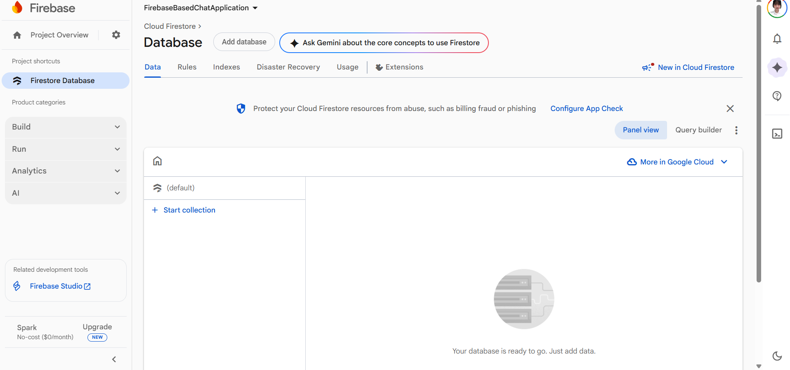

# Firebase-Based Chat Application (UI Only)

A modern Android chat application UI built with Kotlin and Material Design components. This project demonstrates the user interface for a Firebase-based chat application as part of the Mobile Development course.

## 📱 Features

### Implemented UI Components
- **Login Screen**
  - Email/Password input fields
  - Anonymous login option
  - Material Design components
  - Input validation

- **Chat Screen**
  - Real-time message display (simulated)
  - Sent and received message bubbles
  - Message timestamps
  - Sender names for received messages
  - Message input field with send button
  - Logout functionality

### UI/UX Highlights
- Material Design 3 components
- Responsive layouts
- Clean and modern interface
- Smooth animations
- User-friendly navigation

## 🛠 Technologies Used

- **Language**: Kotlin
- **UI Framework**: Android XML Layouts
- **Design**: Material Design Components
- **Architecture**: Activity-based navigation
- **RecyclerView**: For message list display

## 📂 Project Structure

```
app/
├── src/main/
│   ├── java/com/example/firebasebasedchatapplication/
│   │   ├── LoginActivity.kt          # Login screen logic
│   │   ├── ChatActivity.kt           # Chat screen logic
│   │   ├── MessageAdapter.kt         # RecyclerView adapter
│   │   ├── Message.kt                # Message data model
│   │   └── MainActivity.kt           # Main activity (unused)
│   └── res/
│       ├── layout/
│       │   ├── activity_login.xml    # Login screen layout
│       │   ├── activity_chat.xml     # Chat screen layout
│       │   ├── item_message_sent.xml # Sent message item
│       │   └── item_message_received.xml # Received message item
│       ├── menu/
│       │   └── chat_menu.xml         # Chat screen menu
│       ├── values/
│       │   ├── strings.xml           # String resources
│       │   ├── colors.xml            # Color palette
│       │   └── themes.xml            # App themes
│       └── drawable/                 # App icons
```

## 🚀 Getting Started

### Prerequisites
- Android Studio (latest version)
- JDK 11 or higher
- Android SDK (API 24+)

### Installation

1. Clone the repository:
```bash
git clone https://github.com/yourusername/FirebaseBasedChatApplication.git
```

2. Open the project in Android Studio

3. Sync Gradle files

4. Run the app on an emulator or physical device

## 📸 Screenshots

### Login Screen

*Login interface with email/password and guest login options*

### Chat Screen

*Chat interface showing sent and received messages*

### Firestore Console (Placeholder)

*Firebase Firestore console view (for future implementation)*

## 🎯 Learning Objectives Covered

✅ Understanding cloud backends in mobile apps  
✅ UI design for authentication screens  
✅ UI design for real-time chat interfaces  
✅ Material Design implementation  
✅ RecyclerView with multiple view types  
✅ Activity navigation  
✅ Input validation  

## 🔮 Future Enhancements (Backend Integration)

When Firebase is integrated, the following features will be added:
- [ ] Firebase Authentication (Email/Password)
- [ ] Firebase Authentication (Anonymous)
- [ ] Cloud Firestore database integration
- [ ] Real-time message synchronization
- [ ] User presence indicators
- [ ] Push notifications with FCM
- [ ] Message persistence
- [ ] User profiles

## 📝 Notes

- This is a **UI-only implementation** as per course requirements
- No actual Firebase backend is connected
- Messages are simulated locally
- Sample data is used for demonstration

## 👨‍💻 Author

**[Your Name]**  
Mobile Development Course  
[Your University/Institution]

## 📄 License

This project is created for educational purposes as part of the Mobile Development course.

## 🙏 Acknowledgments

- Course instructor and teaching assistants
- Material Design guidelines by Google
- Android documentation and community
